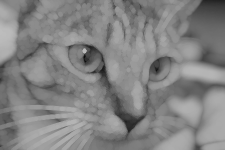
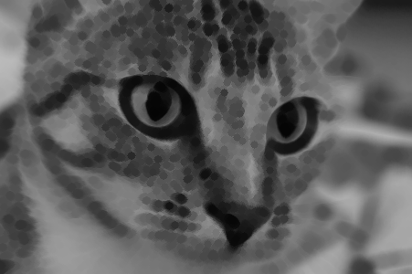

# Laboratorium 1
> Wczytywanie, wyświetlanie i zapisywanie plików graficznych, elementy strukturalne, filtry uśredniające i medianowe, dylatacja, erozja i konturowanie.

## Używane moduły

```python
from skimage import data, io, filters, util, morphology
```

- [data](http://scikit-image.org/docs/dev/api/skimage.data.html) — standardowe obrazy testowe,
- [io](http://scikit-image.org/docs/dev/api/skimage.io.html) — odczytywanie i zapisywanie obrazów
- [filters](http://scikit-image.org/docs/dev/api/skimage.filters.html)
- [util](http://scikit-image.org/docs/dev/api/skimage.util.html)
- [morphology](http://scikit-image.org/docs/dev/api/skimage.morphology.html)

## Operacje
### Wczytywanie, wyświetlanie i zapisywanie plików graficznych

Baza danych.

```python
image = data.coins()
```

Plik.

```python
image = io.imread('lena.png')
```

Wyświetlenie.

```python
io.imshow(image)
io.show()
```

Zapis do pliku.

```python
io.imsave('foo.png', image)
```

### Filtrowanie

Wczytujemy obraz.

```python
image = io.imread('lena.png')
```


I dodajemy szum typu pieprz i sól.

```python
noisedImage = util.random_noise(image, mode = 's&p')
```


#### Filtr uśredniający

Na przykład Gaussa.

```python
gau = filters.gaussian(image, sigma = .5)
```


#### Filtr medianowy
Tworzymy element strukturalny

```python
selem = morphology.disk(5)
```

Filtrujemy.

```python
med = filters.median(image, selem)
```


### Operacje morfologiczne
Morphology is a broad set of image processing operations that process images based on shapes. Morphological operations apply a structuring element to an input image, creating an output image of the same size. In a morphological operation, the value of each pixel in the output image is based on a comparison of the corresponding pixel in the input image with its neighbors. By choosing the size and shape of the neighborhood, you can construct a morphological operation that is sensitive to specific shapes in the input image.


#### Dylatacja

```python
dil = morphology.dilation(image, selem)
```



#### Erozja

```python
ero = morphology.erosion(image, selem)
```



### Segmentacja

```
sob = filters.sobel(image)
```


## Zadania

### Filtrowanie [3]

Dla wybranego przez siebie obrazu, wczytanego z pliku, napisz skrypt, który zbada sześć różnych filtrów, po trzy uśredniające i medianowe. Używaj różnych elementów strukturalnych.

### Przekształcenia morfologiczne[4]
Dane jest proste przekształcenie morfologiczne, będące różnicą pomiędzy mapą dylatacji i erozji obrazu:

```python
dif = dil - ero
```

które produkuje obrazy podobne do poniższego.


Jakie zastosowanie można znaleźć dla tego przekształcenia? Odpowiedź uzasadnij.

### Segmentacja[5]

Korzystając z poniższego tutoriala, przygotuj skrypt zdolny do segmentacji wybranego przez ciebie obrazu. Spróbuj poprawić jakość segmentacji, stosując filtrowanie i przekształcenia morfologiczne. Zaprezentuj zarówno początkową segmentację jak i tę poprawioną.

http://scikit-image.org/docs/dev/user_guide/tutorial_segmentation.html
